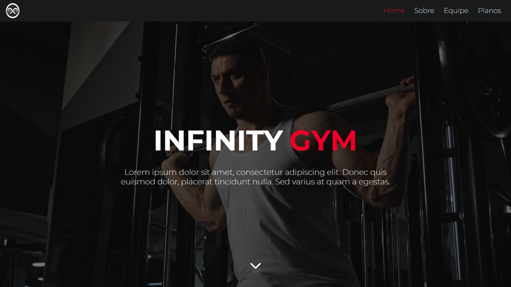
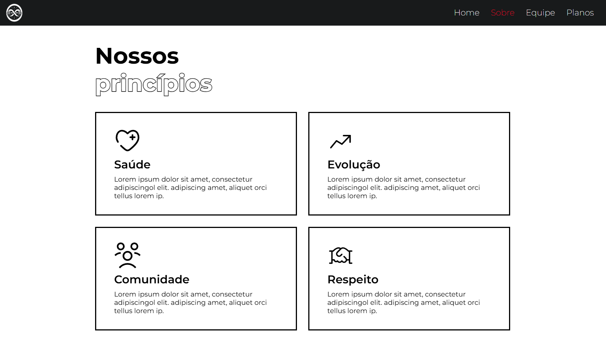
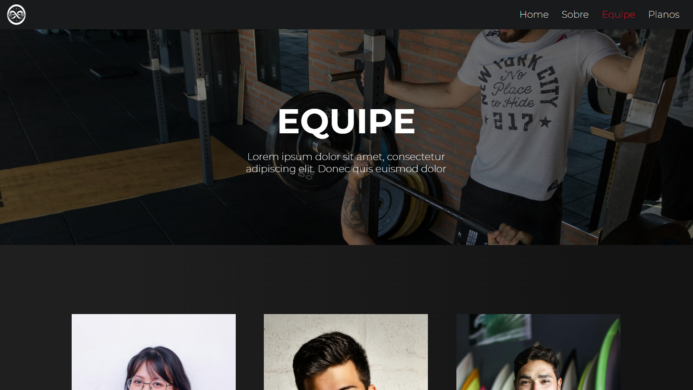

# Infinity Gym 🏋️‍♂️
Esse projeto foi desenvolvido com o intuito de simular uma *landing Page* de uma academia fictícia com o título de Infinity Gym.

O projeto foi feito com React, utilizando vários elementos de *Motion* com os pacotes ```gsap``` e ```lenis``` para dar mais vida ao site.

## 🖼️ Screenshots


*Parte da Página inicial*


*Parte da Página inicial com acesso a página "Sobre"*


*Parte da Página inicial com acesso a página "Planos"*


*Parte da Página "Sobre"*


*Parte da Página "Equipe"*


*Parte da Página "Planos"*


*Cards de planos disponíveis na academia*